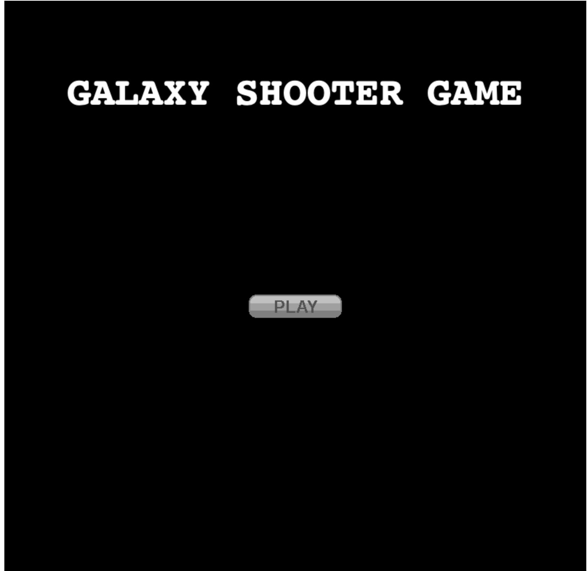
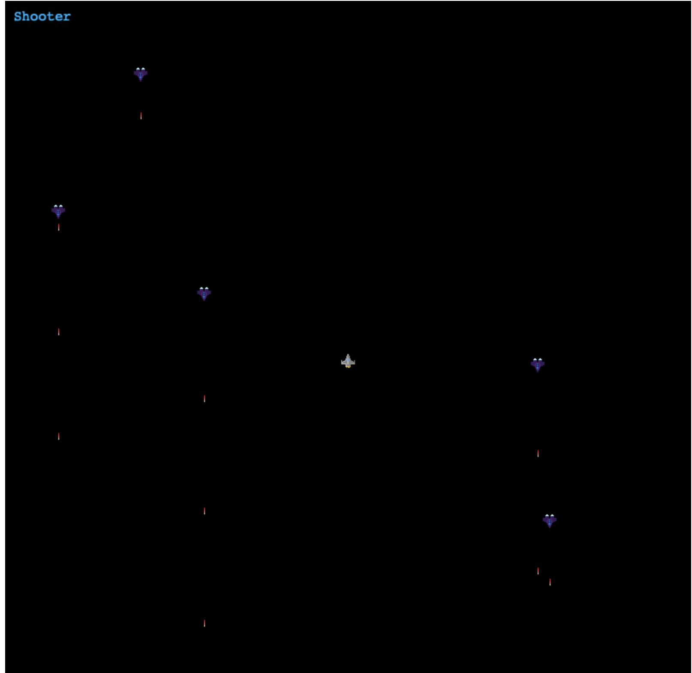
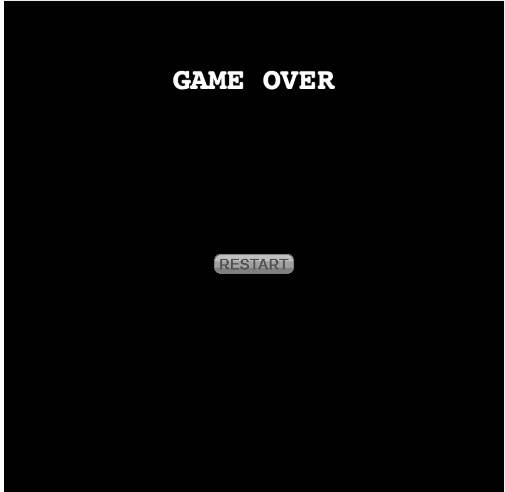

# Shooter Game

<!--
*** Thanks for checking out this README Template. If you have a suggestion that would
*** make this better, please fork the repo and create a pull request or simply open
*** an issue with the tag "enhancement".
*** Thanks again! Now go create something AMAZING! :D
-->

<!-- PROJECT SHIELDS -->
<!--
*** I'm using markdown "reference style" links for readability.
*** Reference links are enclosed in brackets [ ] instead of parentheses ( ).
*** See the bottom of this document for the declaration of the reference variables
*** for contributors-url, forks-url, etc. This is an optional, concise syntax you may use.
*** https://www.markdownguide.org/basic-syntax/#reference-style-links
-->

[![Contributors][contributors-shield]][contributors-url]
[![Forks][forks-shield]][forks-url]
[![Stargazers][stars-shield]][stars-url]
[![Issues][issues-shield]][issues-url]

<!-- PROJECT LOGO -->
<br />
<p align="center">
  <a href="https://github.com/Stephanie041996/Shooter">
    
  </a>
  
  <h3 align="center">The Shooter Game Application</h3>
  
  <p align="center">
    This project is part of the Microverse curriculum in JavaScript course!
    <br />
    <a href="https://github.com/Stephanie041996/Shooter"><strong>Explore the docs</strong></a>
    <br />
    <a href="https://romantic-northcutt-6ed7e5.netlify.app">Live Version</a>
    <br />
    
  </p>
</p>

This is a Space Shooter Game application where the user controls a flying vehicle armed with weapons to shoot against enemy vehicles coming down from the top of the screen

<hr />


## Screen Shots  
### Main Menu Scene  

<hr />

### Main Scene  

<hr />

### Game Over Scene  

<hr />


<!-- ABOUT THE PROJECT -->

## About The Project  

  The project uses the phaser3 game engine and almost all the code is related to this framework  
  Webpack is used to compile src folder content and outputs to dist folder  
   

  Four phaser3 scenes are used :  

    - SceneMainMenu starts the game    

    - SceneMain is the actual game screen  

    - In this scene the game takes in the player and enemy ship and checks for collisions to determin if a score is gained or if the player has been hit and therefore loses the game

    - GemeOver Scene which appears after player's power has been consumed  
        This is the final scene which allows for the option to restart the game

    - LeadersBoard Scene. Shows the top users scores 

          The score is stored remotely using an API  


  The leadersboard API service is created by Microverse dedicated to this application and has 3 options called asynchronously  

    - Get an ID for the application. This is implemented beyond the actual project  

    - Submit a player's score. This is performed after each game session only if the score is higher than zero  

    - Get the scores list. This is called in leadersboard scene  

<hr/>

<!-- ABOUT THE PROJECT -->

## Application Instructions  

  * In the Main Menu scene click Play to start the game    

  * In the Main Game scene use the keyboard arrows to move in 2 dimensions and the space bar to shoot weapons against the enemy ships that are coming down from the screen top. Every enemy ship you hit gains you 10 points. 
      
  * If You are hit by a enemy ship or thier laser you will lose and the game ends 

  * The LeadersBoard scene shows only the top scores  

<hr/>

## Live Version

[GitHub Pages](https://romantic-northcutt-6ed7e5.netlify.app)

<hr/>

## System Requierments

  - JavaScript Enabled  
  - You need to Disable Cross-Origin-Restrictions from your browser if you want to open the index.html from your file system without using a server.  

<hr/>

## Development
  * Clone the project
  ```
  https://github.com/Stephanie041996/Shooter.git
    
    Use VSCode and Live Server to show index.html
    Since webpack is used, run 'npm run build' on you terminal before opening
  ``` 
<hr/>

## Dependencies

  please run
  ```
    npm run build
  ```
  to comply with the dependencies held in package.json
<hr/>

## Built With

This project was built using these technologies.

  - Phaser3  
  - JavaScript (ES6)  
  - HTML5  
  - CSS3  
  - webpack  
  - APIs  
  - Git - GitHub  
  - ESLint  
  - Stylelint  

<hr/>

<!-- CONTACT -->


​
## Author
**Stephanie Sakuhuni**

- GitHub: [@stephanie041996](https://github.com/Stephanie041996)
- LinkedIn: [Stephanie Sakuhuni](www.linkedin.com/in/stephanie-michelle-sakuhuni) 

​
<hr/>
<!-- ACKNOWLEDGEMENTS -->

## Acknowledgements

  - [Microverse](https://www.microverse.org/)
  - [The Odin Project](https://www.theodinproject.com/)


